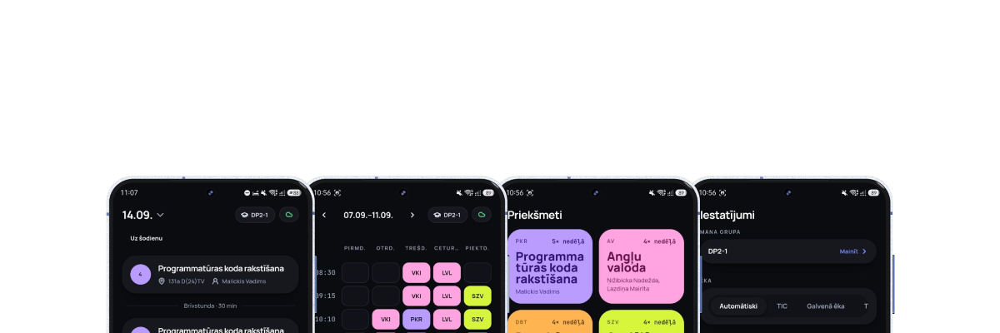
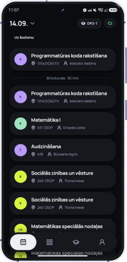
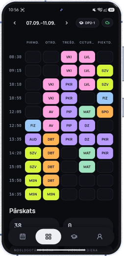
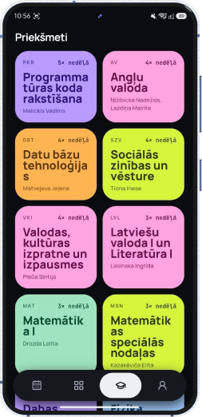
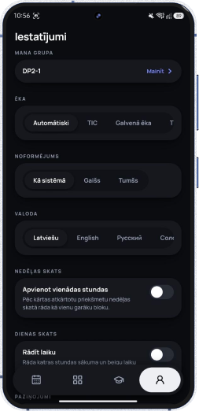

Stundio takes the public timetable from **Rīgas Valsts tehnikums** (`pikcrvt.edupage.org`) and turns it into a fast, offline-friendly schedule app.

There’s no login, no account, and no complicated setup. Pick your class and you can immediately see your lessons, substitutions, and what you have right now or next.

It runs as an Android app and as an installable web app (PWA) at **[stundio.pages.dev](https://stundio.pages.dev)**, which is also how iPhone and desktop users get it.

The name comes from **“stunda”**, the Latvian word for “lesson”.

Stundio is made specifically for students at the school. The idea is simple: you should be able to check your timetable in a few seconds, even when the Wi-Fi or mobile signal inside the building is terrible.

That’s why the app is **local-first**. Your timetable is stored on your device and updated in the background, so the app remains useful even when you’re offline.

## Screenshots

<div align="center">

| Day view | Week view | Subjects & Colors | Settings |
| :---: | :---: | :---: | :---: |
|  |  |  |  |

</div>

## What it does

* **Day view** — See today’s lessons in one place. The current lesson is highlighted with a live progress bar, free periods appear as gaps, and cancelled lessons stay visible but are crossed out.
* **Week view** — A Monday-to-Friday overview for quickly comparing your schedule across the week, with structural spanning for double periods and direct day navigation.
* **Substitutions** — EduPage publishes things like room changes, teacher changes, and cancellations as Latvian HTML. Stundio parses that information and attaches it directly to the affected lesson instead of creating a separate changes feed.
* **Home-screen widgets (Android)** — Three native home-screen widgets keeping your schedule a glance away:
  * **Next Lesson (2×1)** — The current or upcoming lesson with its room, teacher, start/end times, and status.
  * **Countdown** — Dedicated time-remaining counter and visual progress bar until the next bell.
  * **All-Day Schedule (4×2)** — Scrollable schedule of today's full timetable and room assignments.
  Widgets stay fresh via app syncs, lesson transition alarms, and periodic Android WorkManager tasks.
* **Customization & Themes** — Personalize your experience:
  * Pick from preset pastel accents or use the interactive **Color Wheel** to assign custom colors to any subject.
  * Toggle monochrome mode if you prefer a clean, neutral look.
  * Light, dark (with dedicated high-contrast black/white styling), or system theme.
* **Subgroup switcher** — Classes with split groups (e.g., 1. grupa / 2. grupa) can filter the timetable to show only their assigned group's lessons.
* **Change notifications** — Get told when your day changes. Android delivers these locally from the app's own background refresh; the web app uses Web Push, so an installed PWA is notified even while it's closed.
* **In-app feedback** — Report bugs or submit feature suggestions directly inside the app without third-party forms.
* **Share your week as an image** — Turn the week view into a picture: your class, your form teacher, every lesson with its start and end time, and a note about which days are at another building. Under the grid, every subject code is spelled out in full, and it ends with a QR code so whoever you send it to can scan it and get the app. The image is drawn on your own device and passed straight to Android's share sheet, so it works offline and nothing is uploaded anywhere.
* **Class picker** — Save your favourite classes and switch between them whenever you need to. Your selection is stored on the device.
* **Offline-first** — The UI always works from the local cache. The app refreshes when you open it, manually pull to refresh, or return to the app. Offline detection warns when network is unavailable without blocking access to cached schedules.
* **Four languages** — The app interface is available in Latvian, English, Russian, and Ukrainian. Substitution notes from the school are kept exactly as published and clearly marked as school-provided text.

## What it is not

Stundio isn't trying to be a replacement for EduPage.

* It only targets the public, class-based timetable of this school.
* There are no student accounts or individual logins.
* It isn't a grades app. An **e-klase** integration is an idea for Phase 6, but nothing has been decided or started yet.
* There is no Stundio account server, and no database of users. Your timetable, settings, and cache live on your device.
* On Android the app talks to `pikcrvt.edupage.org` directly. The web app can't, because browsers block the cross-origin request, so it goes through a thin Cloudflare Pages Function that forwards the same request unchanged ([functions/](functions)). That proxy stores nothing. Two other small Functions handle the APK download redirect and Web Push delivery.

## Project status

Phases 0 through 4, the widget track, and Phase 7 are complete:
- Core scraper, parser, offline caching, and synchronization.
- Full UI (Day, Week, Subjects, Class Picker, Settings, Lesson Sheet, Subgroups).
- Customization: custom color wheel, subject color overrides, and theme controls.
- Android packaging, edge-to-edge system bars, local change notifications, and background refresh via WorkManager.
- Native Android home-screen widgets (Next Lesson 2×1, Countdown, and All-Day 4×2 list).
- Web and iOS as a PWA on Cloudflare Pages, with an edge proxy for EduPage requests and Web Push for schedule changes.

Phase 5 (release and distribution) is in progress. There will be no Google Play release: for an unofficial timetable parser, app-store distribution carries legal risk the project doesn't want, so APKs ship through GitHub Releases and the app updates itself from there.

After that come Phase 6 (an e-klase grades integration, still undecided) and Phase 8 (Teacher Mode).

For the detailed roadmap and progress history, see [PLAN.md](PLAN.md). For an explanation of how the EduPage scraping works, see [MODEL.md](MODEL.md).

## Installing on Android

Stundio isn't on the Play Store, and won't be. APKs are published through [GitHub Releases](https://github.com/dmytropolizhai/stundio/releases) instead.

### Option A — Download the release APK

1. Open **[stundio.pages.dev/download](https://stundio.pages.dev/download)**, which redirects to the latest release APK. (The [Releases page](https://github.com/dmytropolizhai/stundio/releases) works too if you'd rather pick the file yourself.)
2. Open the downloaded APK on your Android phone.
3. Android will warn you that the app comes from an unknown source. That's expected, because it isn't distributed through the Play Store.
4. Allow installation from the app you're using to open the APK when Android asks.

Once installed, the app checks GitHub for newer releases itself and offers to install them, so you only have to do this manually the first time.

Keep in mind that this is still an early alpha. There may be rough edges.

### Option B — Build it yourself

You'll need:

* **Node.js 20** (pinned in `.nvmrc`) and npm
* **Android Studio** — mainly for the Android SDK and `adb`
* **JDK 21**
* An Android phone with USB debugging enabled, or an Android emulator

To use a physical phone, enable USB debugging through:

**Settings → About phone → tap “Build number” 7 times → Developer options → USB debugging**

Then, from the project root:

```bash
npm install
npm run android
```

`npm run android` builds the web app, syncs it into the Capacitor Android project in [android/](android), and launches it on a device or emulator detected by `adb`.

If multiple devices are connected, you'll be asked which one to use.

If you want to build an APK yourself instead:

```bash
npm run build
npx cap sync android
npx cap open android
```

This opens the project in Android Studio. From there, use:

**Build → Build Bundle(s) / APK(s) → Build APK(s)**

You can then copy the APK to your phone and install it. Android may ask you to allow installations from unknown sources for whichever app you use to open the APK.

## Installing on iOS

There's no native iOS app, and there are no plans for one — for a non-commercial school project with roughly 100–250 potential users, an Apple Developer account and a separate native build don't make sense. iOS is served by the PWA instead, so you don't need the App Store, Xcode, or a developer account:

1. Open **[stundio.pages.dev](https://stundio.pages.dev)** in **Safari** on your iPhone or iPad.
2. Tap the **Share** button.
3. Select **Add to Home Screen**.
4. Stundio will appear on your home screen and open like an app, without the normal browser UI.

The app prompts you through these steps the first time you open it on an iPhone.

A couple of things differ from Android. Home-screen widgets are a native Android feature and aren't available on iOS. Notifications work, but through Web Push, which iOS only supports once the app has been added to the home screen — opening the site in a Safari tab isn't enough. The timetable, substitutions, sharing, and offline caching all work the same.

## Development

```bash
npm install
npm run dev             # Start the Vite dev server
npm test                # Run the test suite
npm run test:coverage   # Run the tests with coverage thresholds
npm run typecheck       # Run TypeScript checks
npm run lint            # Run ESLint
npm run format          # Format with Prettier
npm run build           # Build the production app
```

CI runs, in that order, lint, a formatting check (`npm run format:check`), typecheck, tests with coverage, and the build. Running the same locally is enough to know a change will pass.

During development, EduPage requests are proxied through Vite to avoid CORS issues. In production the web app uses the Cloudflare Pages Function in [functions/](functions) for the same reason; Android has no such restriction and calls EduPage directly.

For the project's architecture and coding conventions, see [AGENT.md](AGENT.md).

If you're interested in how the EduPage integration works, [MODEL.md](MODEL.md) documents the reverse-engineered API contract.

The planned features and current progress are tracked in [PLAN.md](PLAN.md).

## Privacy

There are no accounts, no logins, and no user identifiers. Your timetable, settings, and cache never leave your device, and nothing about you is stored on a server.

What the app talks to:

* **`pikcrvt.edupage.org`** — the school's public timetable and substitutions. On the web this goes through Stundio's own Cloudflare Pages proxy, which forwards the request and keeps no copy.
* **GitHub** — to check whether a newer release exists.
* **Plausible** — anonymous usage counts (which screens get opened), with no cookies and no persistent visitor id. It's **opt-out in Settings**, and turning it off stops the pings entirely.
* **Stundio's push Function** — only if you turn on notifications in the web app. It stores the browser-issued push subscription needed to deliver them, and nothing else; turning notifications off removes it.

None of this involves personal data. Stundio never asks for your name, your account, or anything that identifies you.

## License

Stundio is licensed under the [MIT License](LICENSE).

Stundio is an unofficial, non-commercial student project. It isn't affiliated with, endorsed by, or supported by Rīgas Valsts tehnikums, EduPage, or aSc.
